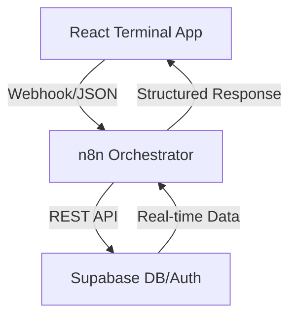

# 🌌 NARA Project: Personal Intelligent Companion


*(Note: Replace with the actual image path after pushing to GitHub or use the generated artifact)*

> **Neural Automated Resource Agent (NARA)** is a high-performance personal orchestration platform designed to manage Health (RAGA) and Finance (ARTA) with a pure n8n-driven backend architecture.

---

## 🚀 Key Features

### 🥗 RAGA (Health & Nutrition)
- **Log Daily Activity**: Track meals, calories, and biometrics.
- **Smart BMI Calculator**: Real-time BMI and TDEE calculation.
- **Goal Tracking**: Set weight targets and monitor progress with interactive visual scales.
- **AI-Ready**: Designed for contextual health insights.

### 💰 ARTA (Atur Rekap Transaksi Anda)
- **Lightning Fast Transactions**: Optimized parallel n8n workflows for sub-second data retrieval.
- **Visual Analytics**: Monthly spending summaries and category-based breakdowns.
- **Self-Healing Schema**: Automatic category seeding for new users.
- **Transaction Management**: Comprehensive CRUD operations for all financial records.

---

## 🏛️ System Architecture

NARA uses a modern **Orchestration Architecture** where the frontend is entirely decoupled from the business logic.



- **Frontend**: React 18, Vite, Tailwind CSS, Shadcn UI, Framer Motion.
- **Orchestrator**: n8n (Modular workflows).
- **Backend & Auth**: Supabase.

---

## 🛠️ Installation & Setup

### 1. Prerequisite
- Node.js (v18+)
- Supabase Account
- n8n instance (Self-hosted or Cloud)

### 2. Frontend Setup
```bash
cd nara-app
npm install
npm run dev
```

### 3. n8n Configuration
- Import `.json` workflows from the `/n8n workflow` folder into your n8n instance.
- Configure Webhook URLs in your `.env` file.

### 4. Environment Variables
Create a `.env` file in the root directory:
```env
VITE_SUPABASE_URL=your_supabase_url
VITE_SUPABASE_ANON_KEY=your_supabase_key
VITE_N8N_AUTH_WEBHOOK_URL=...
VITE_N8N_RAGA_WEBHOOK_URL=...
VITE_N8N_ARTA_WEBHOOK_URL=...
```

---

## 🗺️ Roadmap
- [x] **Phase 1**: Core Auth & Google Integration.
- [x] **Phase 2**: RAGA Health Pillar.
- [x] **Phase 3**: ARTA Finance Pillar.
- [ ] **Phase 4**: MASA (Agenda & Task Management).
- [ ] **Phase 5**: WhatsApp AI Integration (LLM Context).

---

## 🤝 Contribution
NARA is built with a focus on **Visual Excellence** and **Speed**. Feel free to fork and submit PRs for new "Pillars".

---

## 📄 License
MIT License. Created with ❤️ by NARA Team.
