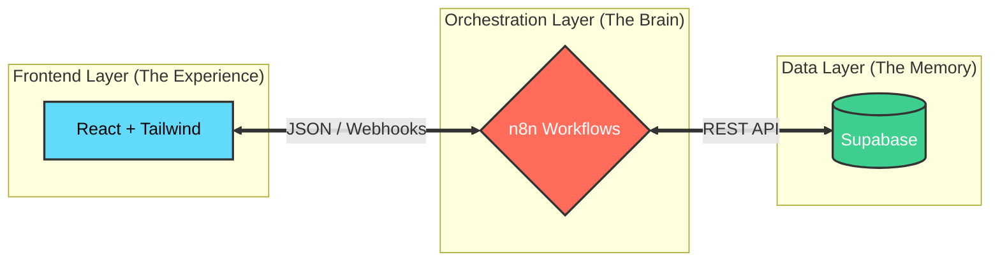

<p align="center">
  
</p>

<h1 align="center">🌠 NARA: The Neural Automated Resource Agent</h1>

<p align="center">
  <strong>Orchestrating Life with High-Performance Automation</strong>
</p>

<p align="center">
  
  
  
  
</p>

---

## 💎 The Vision

NARA isn't just an app; it's a **Personal Control Center**. Designed for those who value speed, data integrity, and futuristic UI, NARA leverages the power of low-code orchestration (n8n) to handle complex logic while keeping the frontend remarkably lean and blazingly fast.

---

## 🏛️ Project Pillars

### 🥗 RAGA (Health & Nutrition Rituals)
> *Empowering your body through data.*

<p align="center">
  
</p>

- **Biometric Intelligence**: Real-time TDEE and BMI calculations based on profile synchronization.
- **Nutrition Orchestration**: Seamless meal logging with instant calorie summary feedback.
- **Visual Targets**: Interactive weight target scales with precise labels and markers.

### 💰 ARTA (Atur Rekap Transaksi Anda)
> *Master your wealth, one byte at a time.*

<p align="center">
  
</p>

- **Turbo Retrieval**: Parallel n8n fetching logic for sub-second financial history loading.
- **Self-Healing Data**: Automatic schema seeding ensures a smooth Day-1 user experience.
- **Analytics at a Glance**: Dynamic SVG charts providing deep insights into monthly spending.

---

## ⚙️ The Architecture of Tomorrow

NARA operates on a "Frontend-as-a-Shell" philosophy. Every major business logic decision is made within an **Orchestration Layer**, ensuring flexibility and rapid evolution.



---

## 🛠️ Quick Start

### Frontend
```bash
cd nara-app
npm install && npm run dev
```

### Backend (Orchestration)
1. Import all `.json` blueprints from `/n8n workflow`.
2. Map your Supabase Credentials to `NARA Auth`, `NARA RAGA`, and `NARA ARTA`.
3. Activate Webhooks.

---

## ⚡ Next Frontiers
- [ ] **MASA**: The Productivity & Agenda Pillar.
- [ ] **WhatsApp Integration**: Chat-to-Action via LLM-powered n8n nodes.
- [ ] **Voice Control**: Voice-activated dashboard commands.

---

<p align="center">
  Created with ❤️ by <strong>kodok-ijho</strong>
  <br>
  Built on the principles of <strong>Speed, Aesthetic, and Automation.</strong>
</p>
