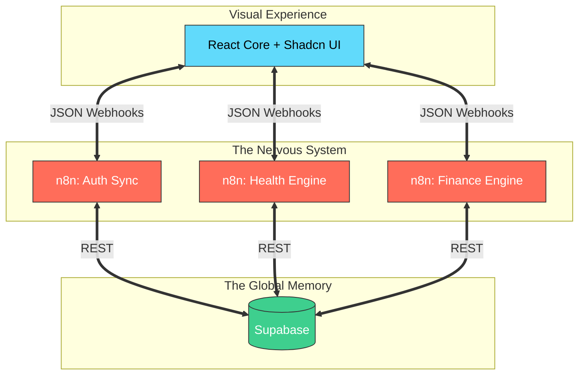

<p align="center">
  
</p>

<h1 align="center">🌌 NARA: Neural Automated Resource Agent</h1>

<p align="center">
  <strong>The Ultimate Life Orchestration Engine. Built for Speed. Designed for Impact.</strong>
</p>

<p align="center">
  <a href="https://github.com/kodok-ijho/NARA">
    
  </a>
  <a href="https://n8n.io">
    
  </a>
  <a href="https://supabase.com">
    
  </a>
</p>

---

## 🇮🇩 Kenalkan NARA: Asisten Masa Depan Kamu

NARA bukan sekadar aplikasi pencatat. NARA adalah sebuah **Orchestration Master** yang menghubungkan ritual kesehatan kamu (**RAGA**) dan manajemen finansial kamu (**ARTA**) ke dalam satu dashboard yang sangat "enteng" dan visualnya mewah.

Built using a **Pure Webhook Architecture**, NARA menghapus kerumitan backend tradisional dan menggantinya dengan alur kerja n8n yang sangat fleksibel.

---

## 🚀 The Core Pillars

### 🥗 RAGA (Health Rituals)
> *Because your metrics matter.*

<p align="center">
  
  
</p>

#### **RAGA Features:**
- **Smart BMI Scale**: Hitung BMI & TDEE secara otomatis dari profil kamu.
- **Ritual Tracking**: Log makanan dan aktivitas dengan sinkronisasi n8n.
- **Contextual Insights**: NARA AI siap memberitahu kapan kamu butuh istirahat atau nutrisi tambahan.

#### **ARTA Features:**
- **Lightning CRUD**: Operasi data finansial yang super cepat (add, edit, delete).
- **Auto-Seeding**: Baru pertama kali pakai? NARA otomatis siapkan kategori buat kamu.
- **Spend Visualization**: Grafik pengeluaran yang tajam dan informatif.

---

## 🧠 Brain Structure (n8n Architecture)

The logic is 100% decoupled from the UI. This means NARA is **future-proof**.



---

## 🛠️ Deployment in 2 Minutes

### 1. The Shell (Frontend)
```bash
git clone https://github.com/kodok-ijho/NARA.git
cd nara-app && npm install && npm run dev
```

### 2. The Soul (n8n)
- Import workflows from `/n8n workflow`.
- Hubungkan instance n8n kamu ke Supabase.
- Masukkan URL webhook ke file `.env` kamu.

---

## 🔮 Roadmap: What's Next?
- [ ] **MASA**: Agenda & Productivity management.
- [ ] **LLM Integration**: Chat with NARA via WhatsApp using Gemini/GPT.
- [ ] **Voice Command**: Control your dashboard with voice triggers.

---

<p align="center">
  <strong>Dibuat dengan ❤️ untuk masa depan yang lebih teratur.</strong>
  <br>
  <em>Designed & Engineered by <a href="https://github.com/kodok-ijho">kodok-ijho</a></em>
</p>
